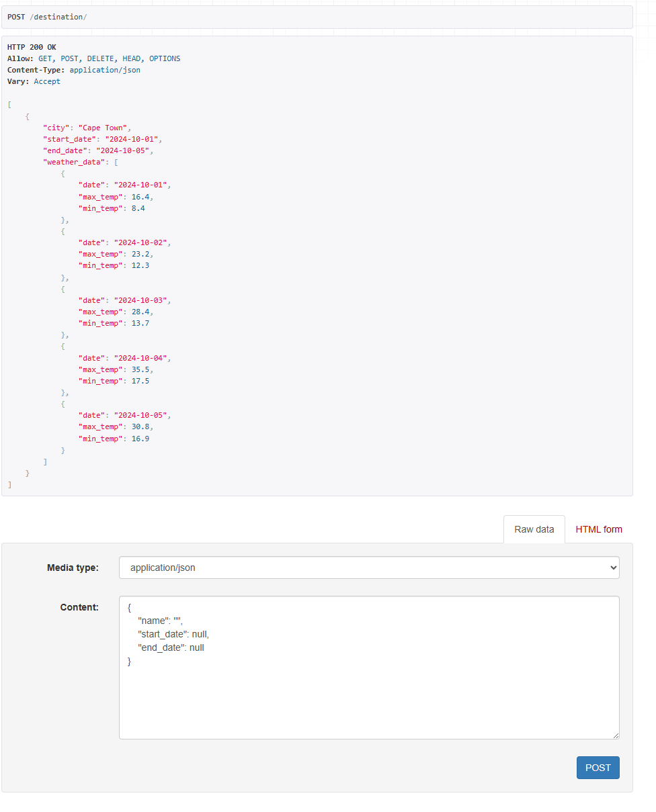

# Holiday Planner API 
This is a Holiday Planner API built using **Django** and **Django Rest Framework** (DRF). The API allows users to create and manage holiday destinations and fetch weather information for specified dates using a third-party weather API. The project uses **Docker** for containerization and connects to a **SQLite** database.


## Features

- Create and manage holiday destinations with fields like city,star date and end date.
- Fetch real-time weather information for a specified city and date range using a third-party weather API.
- Automated testing for ensuring the robustness and reliability of the API.
- Dockerized deployment for easy setup and running of the application.

## Tools used 
#### Django : Django is a free and open-source, Python-based web framework that runs on a web server.


### SQLite: SQLite is a database engine written in the C programming language.


### Open-meteo : Open-Source ☀️️️️️️️️️️️️️️️️️️️️️️️️️️️️️ Weather API with free access for non-commercial use.


### Docker : Docker is a set of platform as a service products that use OS-level virtualization to deliver software in packages called containers


## API Endpoints

### Destination List and Create

- **URL**: `/destinations/`
- **Description**: Fetches the weather data based on the city name inputed by user.

## Build and run the Docker containers:
docker compose up --build

## Run django directly: 
 python manage.py runserver


# Testing data : 
```json
{
  "name": "Cape Town",
  "start_date": "2024-10-01",
  "end_date": "2024-10-05"
}
```
#### results: 
```json 
{
        "city": "Cape Town",
        "start_date": "2024-10-01",
        "end_date": "2024-10-05",
        "weather_data": [
            {
                "date": "2024-10-01",
                "max_temp": 16.4,
                "min_temp": 8.4
            },
            {
                "date": "2024-10-02",
                "max_temp": 23.2,
                "min_temp": 12.3
            },
            {
                "date": "2024-10-03",
                "max_temp": 28.4,
                "min_temp": 13.7
            },
            {
                "date": "2024-10-04",
                "max_temp": 35.5,
                "min_temp": 17.5
            },
            {
                "date": "2024-10-05",
                "max_temp": 30.8,
                "min_temp": 16.9
            }
        ]
    }
```




## Contacts: 
### Author : Dan Phala
### Emal : mrphalad@gmail.com 
